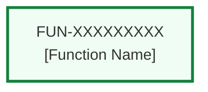
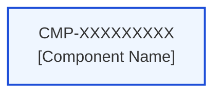
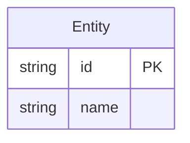
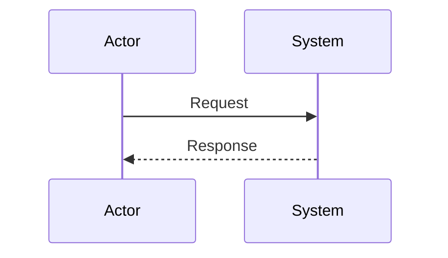
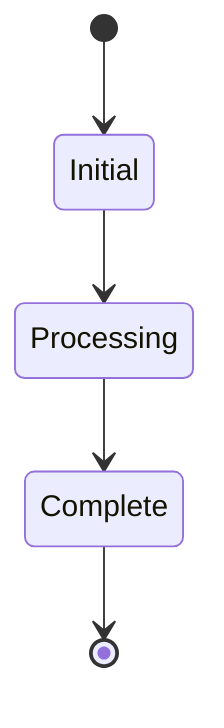

# AI AGENT SYSTEMS ENGINEERING PLAN
**Version**: 4.0
**Last Updated**: 2026-06-16
**Author**: Joel Anderson

## Overview
This document provides comprehensive guidance for Claude Code to carry out systems engineering activities using the Anvil SE framework. It covers the full V-model process from stakeholder needs (Customer Requirements) through system requirements analysis, functional architecture, design synthesis (Functions and Components), and verification (Test Cases). This is the single source of truth for all SE activities.

## Table of Contents
- [Command Examples](#command-examples)
- [Core Principles](#core-principles)
- [TASK: DISCOVERY](#task-discovery)
- [CUSTOMER REQUIREMENTS DEFINITION PLAN](#customer-requirements-definition-plan)
- [SYSTEM REQUIREMENTS ANALYSIS PLAN](#system-requirements-analysis-plan)
- [FUNCTION DEVELOPMENT PLAN](#function-development-plan)
- [COMPONENT DEVELOPMENT PLAN](#component-development-plan)
- [TEST CASE DEVELOPMENT PLAN](#test-case-development-plan)
- [STANDARDS AND CONVENTIONS](#standards-and-conventions)

---

## Command Examples

**Discovery (documentation only):**
```
Claude, read SOFTWARE_DEVELOPMENT_PLAN.md and perform DISCOVERY within this directory. Reverse-engineer the existing system into CR/SR/FUN/CMP documents. Do not modify any application code.
```

**Customer Requirements Elicitation:**
```
Claude, read SOFTWARE_DEVELOPMENT_PLAN.md and run the CUSTOMER REQUIREMENTS DEFINITION PLAN for CR-XXXXXXXXX.
```

**System Requirements Analysis:**
```
Claude, read SOFTWARE_DEVELOPMENT_PLAN.md and run the SYSTEM REQUIREMENTS ANALYSIS PLAN for SR-XXXXXXXXX.
```

**Function Development:**
```
Claude, read SOFTWARE_DEVELOPMENT_PLAN.md and run the FUNCTION DEVELOPMENT PLAN for FUN-XXXXXXXXX.
```

**Component Development:**
```
Claude, read SOFTWARE_DEVELOPMENT_PLAN.md and run the COMPONENT DEVELOPMENT PLAN for CMP-XXXXXXXXX.
```

**Test Case Development:**
```
Claude, read SOFTWARE_DEVELOPMENT_PLAN.md and run the TEST CASE DEVELOPMENT PLAN for TC-XXXXXXXXX.
```

---

## Core Principles

### Systems Engineering Model
The Anvil SE framework follows the classic V-model process:

```
Customer Requirement  (CR)
  └── System Requirement  (SR)       ← derived from CR
        ├── Function  (FUN)          ← satisfies SR
        │     └── Component  (CMP)   ← realises Function
        │           └── Requirement  (FR / NFR)  [+ ICD Reference]
        └── Test Case  (TC)          ← verifies SR
```

Traceability chain:
```
CR ──derives──► SR ──allocates──► FUN ──realises──► CMP ──implements──► FR/NFR
                 ▲
                 └──verified by── TC
```

### Quality and Governance
- All development follows strict approval workflows
- Pre-condition verification prevents bypassing quality gates
- State-based progression ensures proper task sequencing

### Documentation-First Approach
- Specifications are created before implementation
- Technical designs guide development
- All artifacts are version controlled and traceable

### Traceability Requirements
- Every SR must reference at least one CR
- Every FUN must reference at least one SR in its Allocated System Requirements table
- Every CMP must reference exactly one FUN
- Every TC must reference at least one SR
- AI agents must validate upstream links before transitioning document status

### FORBIDDEN ACTIONS
- **NEVER modify Approval status from "Pending" to "Approved"**
- **NEVER change Approval status from "Approved" to any other value**
- **NEVER modify Approval status for any document type**
- **APPROVAL STATUS IS READ-ONLY FOR AI AGENTS**
- **NEVER fabricate Test Case Actual Results or Pass/Fail Status**

### DISCOVERY EXCEPTION
During DISCOVERY tasks only, AI agents MAY set initial Approval status to "Approved" for newly created documents. This exception applies ONLY to document creation during Discovery. It does NOT apply to modifying existing documents.

### MANDATORY BEHAVIOR
- **ONLY proceed with items that ALREADY have Approval = "Approved"**
- **SKIP items with Approval = "Pending", "Rejected", or any non-Approved status**
- **IMMEDIATE STOP if no approved items exist for the current task**

### VIOLATION CONSEQUENCES
- **ANY attempt to modify approval status = IMMEDIATE WORKFLOW TERMINATION**
- **NO EXCEPTIONS, NO WORKAROUNDS, NO ASSUMPTIONS**
- **WHEN YOU READ THIS ACKNOWLEDGE THAT YOU WILL OBEY**

---

# TASK: DISCOVERY

## Purpose
Analyse an existing project and create structured SE documents (CR, SR, FUN, CMP) within the Anvil framework. Use when examining codebases or systems to reverse-engineer their architecture **FOR DOCUMENTATION PURPOSES ONLY**.

## Discovery Safety Rules

### ABSOLUTE PROHIBITIONS during Discovery
- Writing application code
- Modifying existing source files
- Creating new application components
- Deleting or moving application files
- Running build processes
- Installing dependencies

### ALLOWED during Discovery
- Reading and analysing existing code
- Creating CR, SR, FUN, CMP, TC documents in `specifications/` folder
- Documenting current architecture and traceability
- Analysing requirements and design

## Discovery Process

### Phase 1: Project Analysis
1. Examine directory structure and file organisation
2. Identify main components, services, modules, frameworks
3. Map internal and external dependencies
4. Identify user-facing features and business logic

### Phase 2: Customer Requirement Identification
- Identify what stakeholders need the system to accomplish (operational language, not technical)
- Each CR = one clear stakeholder need with a measurable acceptance criterion
- Group related needs into single CRs; keep them at the "what", not the "how"

### Phase 3: System Requirement Identification
- For each CR, derive measurable, testable technical statements
- Each SR maps to exactly one parent CR
- SRs must be objective and use "The system shall…" format

### Phase 4: Function Identification
- Identify the high-level functional behaviours the system must exhibit
- Each FUN traces to one or more SRs
- Naming: use action verbs (e.g., "Authenticate User", "Process Payment")

### Phase 5: Component Identification
- Identify concrete implementation modules, services, APIs, UI components
- Each CMP traces to exactly one FUN
- Naming: use nouns (e.g., "Authentication Service", "Payment Gateway")

### Phase 6: Document Creation
1. Create `specifications/` directory relative to SOFTWARE_DEVELOPMENT_PLAN.md
2. Create CR files: `{numeric-id}-customer-requirement.md`
3. Create SR files: `{numeric-id}-system-requirement.md`
4. Create FUN files: `{numeric-id}-function.md`
5. Create CMP files: `{numeric-id}-component.md`
6. Ensure traceability links are populated in all documents

### Discovery Document Configuration Rules
**DISCOVERY EXCEPTION** — when creating documents during Discovery:
- All document Status: set to "Implemented" (represents existing functionality)
- All document Approval: set to "Approved"
- Requirement Status (FR/NFR): "Implemented"

---

# CUSTOMER REQUIREMENTS DEFINITION PLAN

## Purpose
Capture what stakeholders need the system to accomplish, in operational language. CRs are the upstream anchor of the entire traceability chain.

## CRITICAL WORKFLOW RULES

### APPROVAL vs STATE
- **Approval**: Authorization to proceed — READ-ONLY for AI agents
- **State**: Current workflow position — AI agents advance state through tasks
- **NEVER skip states even if approved**

### STATE MACHINE COMPLIANCE
- Respect the current Status field value
- Follow tasks in strict sequential order
- Approval does NOT override state requirements

---

## Task 1: Approval Verification (MANDATORY)

**Purpose**: Ensure proper authorisation before proceeding.

### Pre-Conditions Verification
| Condition | Required Value | Action if True | Action if False |
|-----------|----------------|----------------|-----------------|
| CR Approval | "Approved" | Continue to Task 2 | STOP — respond "CR not approved." |

### Critical Rules
- **ABSOLUTE PROHIBITION**: Never ask user to change Pre-Condition values
- **IMMEDIATE TERMINATION**: Stop ALL processing if pre-conditions fail
- **RESPONSE REQUIREMENT**: State "STOPPING due to failed pre-conditions" and which condition failed

### Exit Criteria
- [ ] CR approval verified
- [ ] Decision made (proceed/stop)

---

## Task 2: Elicitation & Analysis

**Purpose**: Capture and refine the stakeholder need into a well-formed CR.

### Pre-Conditions Verification
| Condition | Required Value | Action if True | Action if False |
|-----------|----------------|----------------|-----------------|
| Task 1 | Passed | Continue | STOP |
| CR Status | "In Draft" or "Ready for Review" | Continue to Analysis | SKIP to Task 3 |

### Perform Analysis
| Step | Action | Critical Rule |
|------|--------|---------------|
| 1 | Set CR Status → "In Analysis" | MANDATORY FIRST STEP |
| 2 | Identify the stakeholder and operational context | Record in Source and Rationale fields |
| 3 | Write or refine the CR Statement | Must be one sentence: "The system shall [capability] so that [stakeholder benefit]." |
| 4 | Write Acceptance Criteria | Must be objectively verifiable, from the stakeholder's perspective |
| 5 | Identify derived System Requirements; create SR stubs if Analysis Review = Required | One SR stub per major measurable dimension of the CR |
| 6 | Populate Derived System Requirements table in CR document | SR ID + brief description |
| 7 | Set CR Status → "Ready for Review" | ONLY after all steps complete |

### What to Create During Analysis
- Well-formed CR Statement (one sentence)
- Rationale (operational context, 1–2 paragraphs)
- Acceptance Criteria (bullet list, objectively testable)
- SR stubs in the specifications directory (minimal metadata only)
- Populated Derived SR table in the CR document

### What NOT to Create During Analysis
- ❌ Technical specifications
- ❌ Design documents
- ❌ Implementation details
- ❌ SR content beyond minimal metadata

### SR Stub Configuration Rules (created during CR Analysis)
| CR Analysis Review | SR Approval | SR Status | SR Priority |
|--------------------|-------------|-----------|-------------|
| "Required" | "Pending" | "In Draft" | Same as CR |
| "Not Required" | "Approved" | "In Draft" | Same as CR |

### Exit Criteria
- [ ] CR Statement is one sentence in required format
- [ ] Rationale written
- [ ] Acceptance Criteria written
- [ ] SR stubs created (if Analysis Review = Required)
- [ ] Derived SR table populated in CR document
- [ ] CR Status set to "Ready for Review"

---

## Task 3: Baseline

**Purpose**: Confirm the CR is complete and move it to Approved status (human gate).

### Pre-Conditions Verification
| Condition | Required Value | Action if True | Action if False |
|-----------|----------------|----------------|-----------------|
| Task 2 | Passed | Continue | STOP |
| CR Status | "Ready for Review" | Continue | STOP |

### Completeness Check
| Item | Requirement | Action if Incomplete |
|------|-------------|----------------------|
| CR Statement | One sentence, "The system shall…" format | STOP — complete statement first |
| Rationale | Operational context present | STOP — add rationale |
| Acceptance Criteria | At least one objective criterion | STOP — add acceptance criteria |
| Derived SR table | At least one SR listed | STOP — derive SRs first |

### Post-Condition
This task confirms readiness for human approval. AI agents do NOT set Approval to "Approved". Record in a response that the CR is ready for stakeholder review and approval.

### Exit Criteria
- [ ] All completeness checks passed
- [ ] User notified that CR requires human approval to proceed
- [ ] CR Status remains "Ready for Review" (human sets Approval → "Approved")

---

# SYSTEM REQUIREMENTS ANALYSIS PLAN

## Purpose
Derive measurable, testable technical requirements from Customer Requirements and allocate them to Functions.

## CRITICAL WORKFLOW RULES

### APPROVAL vs STATE
- SR Approval is READ-ONLY for AI agents
- Parent CR must be Approved before SR work begins
- SR state advances through tasks via AI; approval gates are human

---

## Task 1: Approval Verification (MANDATORY)

### Pre-Conditions Verification
| Condition | Required Value | Action if True | Action if False |
|-----------|----------------|----------------|-----------------|
| Parent CR Approval | "Approved" | Continue to next check | STOP — "Parent CR not approved" |
| SR Approval | "Approved" | Continue to Task 2 | STOP — "SR not approved" |

### Exit Criteria
- [ ] Both CR and SR approvals verified
- [ ] Decision made (proceed/stop)

---

## Task 2: Analysis

**Purpose**: Ensure the SR is measurable, testable, and traceable to its parent CR.

### Pre-Conditions Verification
| Condition | Required Value | Action if True | Action if False |
|-----------|----------------|----------------|-----------------|
| Task 1 | Passed | Continue | STOP |
| SR Status | "In Draft" or "Ready for Review" | Continue | SKIP to Task 3 |

### Perform Analysis
| Step | Action | Critical Rule |
|------|--------|---------------|
| 1 | Set SR Status → "In Analysis" | MANDATORY FIRST STEP |
| 2 | Verify SR Statement uses "The system shall [action] [condition] [measurable criterion]" format | Rewrite if not measurable |
| 3 | Confirm parent CR ID is in the Parent Customer Requirements table | If missing, add it |
| 4 | Write Rationale (why this SR is technically necessary to satisfy the parent CR) | |
| 5 | Write Verification Criteria (how this SR will be objectively verified) | Must be specific and objective |
| 6 | Create FUN stubs for functional behaviours needed to satisfy this SR | Naming: action verbs |
| 7 | Populate Allocated Functions table in SR document | FUN ID + description |
| 8 | Set SR Status → "Ready for Review" | ONLY after all steps complete |

### FUN Stub Configuration Rules (created during SR Analysis)
| SR Analysis Review | FUN Approval | FUN Status | FUN Priority |
|--------------------|--------------|------------|--------------|
| "Required" | "Pending" | "In Draft" | Same as SR |
| "Not Required" | "Approved" | "In Draft" | Same as SR |

### Traceability Rule
Every SR must reference at least one CR before status may advance beyond "In Analysis".

### Exit Criteria
- [ ] SR Statement is measurable and testable
- [ ] Parent CR ID listed in Parent CRs table
- [ ] Rationale written
- [ ] Verification Criteria written
- [ ] FUN stubs created
- [ ] Allocated Functions table populated
- [ ] SR Status set to "Ready for Review"

---

## Task 3: Allocation

**Purpose**: Confirm that each FUN referencing this SR has the SR in its Allocated System Requirements table.

### Pre-Conditions Verification
| Condition | Required Value | Action if True | Action if False |
|-----------|----------------|----------------|-----------------|
| Task 2 | Passed | Continue | STOP |
| SR Status | "Ready for Review" or "Allocated" | Continue | SKIP to Task 4 |

### Allocation Verification
| Step | Action | Critical Rule |
|------|--------|---------------|
| 1 | For each FUN in the Allocated Functions table, open the FUN document | |
| 2 | Verify this SR's ID is present in the FUN's Allocated System Requirements table | |
| 3 | If missing, add the SR ID and description to the FUN's Allocated System Requirements table | ONLY if FUN Approval = "Approved" |
| 4 | Set SR Status → "Allocated" | ONLY after all FUNs verified |

### Exit Criteria
- [ ] All FUNs in Allocated Functions table have this SR in their Allocated SR table
- [ ] SR Status set to "Allocated"

---

## Task 4: Verification Planning

**Purpose**: Define how this SR will be verified and create TC stubs.

### Pre-Conditions Verification
| Condition | Required Value | Action if True | Action if False |
|-----------|----------------|----------------|-----------------|
| Task 3 | Passed | Continue | STOP |
| SR Status | "Allocated" | Continue | SKIP (already planned or not ready) |

### Perform Verification Planning
| Step | Action | Critical Rule |
|------|--------|---------------|
| 1 | Confirm Verification Method is set (Inspection / Analysis / Demonstration / Test) | |
| 2 | If Verification Method = "Test": create one TC stub per major verification scenario | |
| 3 | Populate Verification Test Cases table in SR document | TC ID + description |
| 4 | Set SR Status → "Ready for Verification" | |

### TC Stub Configuration Rules
| SR Status | TC Approval | TC Status | TC Verification Method |
|-----------|-------------|-----------|------------------------|
| "Allocated" | "Pending" | "In Draft" | Same as parent SR |

### Exit Criteria
- [ ] Verification Method confirmed
- [ ] TC stubs created (if Verification Method = "Test")
- [ ] Verification Test Cases table populated in SR document
- [ ] SR Status set to "Ready for Verification"

---

# FUNCTION DEVELOPMENT PLAN

## Purpose
Define the functional behaviours the system must exhibit to satisfy allocated System Requirements, and orchestrate Component development.

## CRITICAL WORKFLOW RULES

### APPROVAL vs STATE
- FUN Approval is READ-ONLY for AI agents
- Parent SR must be Approved before FUN work proceeds beyond analysis
- FUN must have at least one SR in its Allocated System Requirements table before Design

### STATE MACHINE COMPLIANCE
- Respect FUN Status field value
- Follow tasks in strict sequential order

---

## Task 1: Approval Verification (MANDATORY)

### Pre-Conditions Verification
| Condition | Required Value | Action if True | Action if False |
|-----------|----------------|----------------|-----------------|
| FUN Approval | "Approved" | Continue to Task 2 | STOP — "Function not approved" |

### Exit Criteria
- [ ] FUN approval verified
- [ ] Decision made (proceed/stop)

---

## Task 2: Analysis

**Purpose**: Analyse the functional behaviour and determine what Components are needed.

### Pre-Conditions Verification
| Condition | Required Value | Action if True | Action if False |
|-----------|----------------|----------------|-----------------|
| Task 1 | Passed | Continue | STOP |
| FUN Status | "Ready for Analysis" | Continue | SKIP to Task 3 |

### Traceability Pre-Condition
Before proceeding: verify that the Allocated System Requirements table contains at least one SR ID. If empty, STOP and inform the user that SR allocation is required before Function analysis can proceed.

### Perform Analysis
| Step | Action | Critical Rule |
|------|--------|---------------|
| 1 | Set FUN Status → "In Analysis" | MANDATORY FIRST STEP |
| 2 | Write Purpose statement (functional behaviour description, system perspective) | |
| 3 | Generate CMP stubs for each concrete implementation element needed | Naming: nouns |
| 4 | Add CMPs to the Components table in the FUN document | CMP ID + description |
| 5 | Set FUN Status → "Ready for Design" | ONLY after all steps complete |

### CMP Stub Configuration Rules
| FUN Analysis Review | CMP Approval | CMP Status | CMP Priority |
|---------------------|--------------|------------|--------------|
| "Required" | "Pending" | "Ready for Analysis" | "High" or "Medium" or "Low" |
| "Not Required" | "Approved" | "Ready for Analysis" | "High" or "Medium" or "Low" |

### Metadata Field Verification (all CMPs must have)
- [ ] Name
- [ ] Type
- [ ] ID (CMP-XXXXXXXXX)
- [ ] Function ID
- [ ] Owner
- [ ] Status
- [ ] Approval
- [ ] Priority
- [ ] Analysis Review
- [ ] Code Review

### Exit Criteria
- [ ] Purpose statement written
- [ ] CMP stubs created with all metadata
- [ ] Components table populated in FUN document
- [ ] FUN Status set to "Ready for Design"

---

## Task 3: Design

**Purpose**: Create technical architecture for the Function.

### Pre-Conditions Verification
| Condition | Required Value | Action if True | Action if False |
|-----------|----------------|----------------|-----------------|
| Task 2 | Passed | Continue | STOP |
| FUN Status | "Ready for Design" or "Ready for Refactor" | Continue | SKIP to Task 4 |
| Allocated System Requirements table | At least one SR entry | Continue | STOP — "SR allocation required before design" |

### Perform Design
| Step | Action | Requirement |
|------|--------|-------------|
| 1 | Set FUN Status → "In Design" | |
| 2 | Verify at least one CMP has Approval = "Approved" | If none approved: STOP — "No components approved for design" |
| 3 | Filter CMPs to those with Approval = "Approved" only | EXCLUDE non-approved CMPs from design |
| 4 | Create Technical Specifications with component interaction design | |
| 5 | Document Capability Dependency Flow Diagram | Show FUN-to-FUN dependencies |

### Design Completion Gate
| Check | Required | Action if Failed |
|-------|----------|------------------|
| Technical Specifications contain actual content | Yes | STOP — fill in design |
| No "(Template)" placeholder text remains | Yes | STOP — replace templates |
| All approved CMPs are covered by the design | Yes | STOP — design remaining CMPs |
| FUN Status → "Ready for Implementation" | Set after all checks pass | |

### Absolute Prohibitions
- Never write implementation code during this task
- Never include unapproved CMPs in design

---

## Task 4: Develop the Components

**Purpose**: Orchestrate the COMPONENT DEVELOPMENT PLAN for each approved Component.

### Pre-Conditions Verification
| Condition | Required Value | Action if True | Action if False |
|-----------|----------------|----------------|-----------------|
| FUN Approval | "Approved" | Continue | STOP |
| FUN Status | "Ready for Implementation" | Continue | STOP |

### Component Processing
| Step | Condition | Action |
|------|-----------|--------|
| 1 | CMP Approval = "Approved" | Run COMPLETE COMPONENT DEVELOPMENT PLAN (Tasks 1–4) for this CMP |
| 1 | CMP Approval ≠ "Approved" | SKIP — explain CMP is not approved |

Each CMP must complete: Approval Verification → Analysis → Design → Implementation in full.

### Post-Condition
| Step | Action | Critical Rule |
|------|--------|---------------|
| 1 | Set FUN Status → "Implemented" | ONLY after all approved CMPs have completed their individual Task 4 |

### Exit Criteria
- [ ] All approved CMPs have completed full Component Development Plan
- [ ] FUN Status set to "Implemented"

---

# COMPONENT DEVELOPMENT PLAN

## Purpose
Implement a specific design element (module, service, API, UI component) that realises a Function, satisfying its Functional and Non-Functional Requirements.

## CRITICAL WORKFLOW RULES

### APPROVAL vs STATE
- CMP Approval is READ-ONLY for AI agents
- Parent FUN must be Approved before CMP work proceeds

### STATE MACHINE COMPLIANCE
- Respect the current CMP Status field
- Follow tasks in strict sequential order

---

## Task 1: Approval Verification (MANDATORY)

### Pre-Conditions Verification
| Condition | Required Value | Action if True | Action if False |
|-----------|----------------|----------------|-----------------|
| Parent FUN Approval | "Approved" | Continue | STOP — "Parent Function not approved" |
| CMP Approval | "Approved" | Continue to Task 2 | STOP — "Component not approved" |

### Exit Criteria
- [ ] Both FUN and CMP approvals verified
- [ ] Decision made (proceed/stop)

---

## Task 2: Analysis

**Purpose**: Analyse the component and determine what requirements it must satisfy.

### Pre-Conditions Verification
| Condition | Required Value | Action if True | Action if False |
|-----------|----------------|----------------|-----------------|
| Task 1 | Passed | Continue | STOP |
| CMP Status | "Ready for Analysis" | Continue | SKIP to Task 3 |

### Perform Analysis
| Step | Action | Critical Rule |
|------|--------|---------------|
| 1 | Set CMP Status → "In Analysis" | MANDATORY FIRST STEP |
| 2 | Write Purpose statement (technical function, 1–2 sentences) | |
| 3 | Generate Functional Requirements (FR-XXXXXXXXX) | What the CMP must do |
| 4 | Generate Non-Functional Requirements (NFR-XXXXXXXXX) | Performance, security, etc. |
| 5 | Configure requirements per Configuration Rules below | |
| 6 | Set CMP Status → "Ready for Design" | ONLY after all steps complete |

### Requirement Configuration Rules
| CMP Analysis Review | Requirement Approval | Requirement Status | Priority |
|---------------------|---------------------|-------------------|----------|
| "Required" | "Pending" | "Ready for Design" | High/Medium/Low |
| "Not Required" | "Approved" | "Ready for Design" | High/Medium/Low |

### ICD Reference Rule
The ICD Reference field in FR/NFR rows is free-text only. Populate it with a value provided by the user (e.g., "ICD-001 §3.2.4"). Do NOT navigate to, parse, or validate ICD documents.

### What to Create During Analysis
- Purpose statement (1–2 sentences)
- FR/NFR rows with complete metadata (no implementation details)
- Empty Technical Specifications section header

### What NOT to Create
- ❌ Detailed technical specifications
- ❌ Implementation designs
- ❌ Diagrams with real content

### Exit Criteria
- [ ] Purpose statement written
- [ ] FR and NFR rows created with appropriate status and approval
- [ ] CMP Status set to "Ready for Design"
- [ ] No detailed specifications written

---

## Task 3: Design

**Purpose**: Create detailed technical design before any implementation.

### Pre-Conditions Verification
| Condition | Required Value | Action if True | Action if False |
|-----------|----------------|----------------|-----------------|
| Task 2 | Passed | Continue | STOP |
| CMP Status | "Ready for Design" or "Ready for Refactor" | Continue | SKIP to Task 4 |
| Requirement Status | "Ready for Design" or "Ready for Implementation" | Include | SKIP this requirement |

### Perform Design
| Step | Action |
|------|--------|
| 1 | Set CMP Status → "In Design" |
| 2 | Verify at least one requirement has Approval = "Approved" — if none, STOP |
| 3 | Replace "Technical Specifications (Template)" header with "Technical Specifications" |
| 4 | For each Requirement with Approval = "Approved" AND Status = "Ready for Design": add to design; set Requirement Status → "Ready for Implementation" |
| 5 | Document APIs (if applicable) |
| 6 | Document Data Models (if applicable) |
| 7 | Document Sequence Diagrams (if applicable) |
| 8 | Document Class Diagrams (if applicable) |
| 9 | Document Data Flow Diagrams (if applicable) |
| 10 | Document State Diagrams (if applicable) |
| 11 | Document CMP Dependency Flow Diagram |

### Design Completion Gate
| Check | Required | Action if Failed |
|-------|----------|------------------|
| "(Template)" text removed from header | Yes | STOP |
| All template placeholder content replaced | Yes | STOP |
| Each approved requirement has design coverage | Yes | STOP |
| CMP Status → "Ready for Implementation" | Set after all checks pass | |

### Absolute Prohibitions
- Never write implementation code during this task
- Never use unapproved or out-of-state requirements in design

---

## Task 4: Implementation

**Purpose**: Implement the component, satisfying each approved requirement.

### Pre-Conditions Verification
| Condition | Required Value | Action if True | Action if False |
|-----------|----------------|----------------|-----------------|
| Task 3 | Passed | Continue | STOP |
| CMP Status | "Ready for Implementation" | Continue | SKIP |
| Requirement Status | "Ready for Implementation" | Implement | SKIP this requirement |

### Perform Implementation
| Step | Action |
|------|--------|
| 1 | Set CMP Status → "In Implementation" |
| 2 | For each Requirement: check Approval = "Approved" AND Status = "Ready for Implementation" |
| 3 | If approved and correct state: implement; set Requirement Status → "Implemented" |
| 4 | If not approved or wrong state: skip — do not implement |
| 5 | Set CMP Status → "Implemented" after all approved requirements complete |

### Exit Criteria
- [ ] Implementation complete for all approved, ready requirements
- [ ] Requirement Status updated "Ready for Implementation" → "Implemented"
- [ ] Unapproved or out-of-state requirements skipped
- [ ] CMP Status set to "Implemented"

---

# TEST CASE DEVELOPMENT PLAN

## Purpose
Define and execute a repeatable procedure that objectively verifies one or more System Requirements. Provides the evidence layer of the V-model's right side.

## Key Rules

### EXECUTION INTEGRITY RULE
- **AI agents are FORBIDDEN from populating Actual Result or Pass/Fail Status without an explicit result provided by the user or an automated pipeline**
- Fabricating test results is a workflow violation equivalent to forging approval
- If the user provides actual results, AI may record them and update SR status accordingly

### VERIFICATION CLOSURE RULE
- An SR may only move to "Verified" status when ALL linked TCs have Pass/Fail Status = "Pass"
- A single TC with Pass/Fail = "Fail" or "Blocked" prevents SR verification

---

## Task 1: Approval Verification (MANDATORY)

### Pre-Conditions Verification
| Condition | Required Value | Action if True | Action if False |
|-----------|----------------|----------------|-----------------|
| Parent SR Approval | "Approved" | Continue | STOP — "Parent SR not approved" |
| TC Approval | "Approved" | Continue to Task 2 | STOP — "Test Case not approved" |

### Exit Criteria
- [ ] SR and TC approvals verified
- [ ] Decision made (proceed/stop)

---

## Task 2: Analysis

**Purpose**: Confirm the SR is ready to be tested and draft the TC objective and prerequisites.

### Pre-Conditions Verification
| Condition | Required Value | Action if True | Action if False |
|-----------|----------------|----------------|-----------------|
| Task 1 | Passed | Continue | STOP |
| TC Status | "In Draft" | Continue | SKIP to Task 3 |

### SR Completeness Check
Before proceeding, verify the parent SR has:
- [ ] Statement field populated (not empty or placeholder)
- [ ] Verification Criteria field populated (objective and specific)
- [ ] Verification Method field set

If any item is missing, STOP and inform the user that the SR must be completed before test case analysis.

### Perform Analysis
| Step | Action | Critical Rule |
|------|--------|---------------|
| 1 | Set TC Status → "In Analysis" | MANDATORY FIRST STEP |
| 2 | Write Objective (one sentence: what SR criterion this test demonstrates) | |
| 3 | Write Prerequisites (environment, tooling, data setup, dependent tests) | |
| 4 | Write Pass/Fail Determination (the specific condition that constitutes Pass vs. Fail) | |
| 5 | Confirm Verification Method matches parent SR's Verification Method | If mismatch, STOP |
| 6 | Set TC Status → "Ready for Review" | ONLY after all steps complete |

### Exit Criteria
- [ ] Objective written (one sentence)
- [ ] Prerequisites documented
- [ ] Pass/Fail Determination written
- [ ] Verification Method confirmed to match parent SR
- [ ] TC Status set to "Ready for Review"

---

## Task 3: Design

**Purpose**: Write the full, step-by-step test procedure.

### Pre-Conditions Verification
| Condition | Required Value | Action if True | Action if False |
|-----------|----------------|----------------|-----------------|
| Task 2 | Passed | Continue | STOP |
| TC Status | "Ready for Review" | Continue | SKIP to Task 4 |

### Perform Design
| Step | Action | Requirement |
|------|--------|-------------|
| 1 | Set TC Status → "In Design" | |
| 2 | Write Test Procedure table: Step / Action / Expected Result | All steps must have unambiguous expected results |
| 3 | Verify each step maps to a specific aspect of the SR's Verification Criteria | |
| 4 | Leave Actual Result section EMPTY | AI must NOT prefill actual results |
| 5 | Confirm Verified System Requirements table references the parent SR | |

### Design Completion Gate
| Check | Required | Action if Failed |
|-------|----------|------------------|
| Test Procedure has at least one step | Yes | STOP |
| Each step has an Expected Result | Yes | STOP |
| Actual Result section is empty | Yes | STOP — do not prefill |
| TC Status → "Approved" (human gate) | Human sets this | Notify user that TC requires human approval before execution |

### Exit Criteria
- [ ] Full Test Procedure table written (Step / Action / Expected Result)
- [ ] Actual Result left blank
- [ ] Verified SR table populated
- [ ] User notified that TC requires human Approval before execution

---

## Task 4: Execution (Human-Performed; AI Records Result)

**Purpose**: Record test execution results provided by the user or CI pipeline.

### Pre-Conditions Verification
| Condition | Required Value | Action if True | Action if False |
|-----------|----------------|----------------|-----------------|
| Task 3 | Passed | Continue | STOP |
| TC Status | "Approved" | Continue | STOP — "TC must be Approved before execution" |

### EXECUTION INTEGRITY ENFORCEMENT
**FORBIDDEN**: AI agents must NOT:
- Infer or guess Actual Results
- Mark Pass/Fail Status based on design expectations
- Assume a test passed because the system was implemented

**ALLOWED**: AI agents MAY:
- Record Actual Result text provided explicitly by the user
- Set Pass/Fail Status to the value provided explicitly by the user or CI pipeline
- Set TC Status → "Executed" after recording a result

### Record Execution Result
| Step | Action | Critical Rule |
|------|--------|---------------|
| 1 | Confirm user has provided explicit Actual Result text | If not provided, STOP — request actual results |
| 2 | Record the provided Actual Result in the Actual Result section | Verbatim from user input |
| 3 | Set Pass/Fail Status to the value provided by user ("Pass" / "Fail" / "Blocked") | |
| 4 | Set TC Status → "Executed" | |
| 5 | Update parent SR's Verification Test Cases table: set TC status column to the result | |
| 6 | Check if ALL TCs linked to the parent SR now have Pass/Fail Status = "Pass" | |
| 7 | If ALL TCs = "Pass": set SR Status → "Verified" | Verification Closure Rule |
| 8 | If ANY TC = "Fail" or "Blocked": leave SR Status unchanged; report verification gap | |

### Exit Criteria
- [ ] Actual Result recorded (from user-provided input only)
- [ ] Pass/Fail Status set
- [ ] TC Status set to "Executed"
- [ ] Parent SR Verification TC table updated
- [ ] SR Status updated to "Verified" if all TCs pass

---

# STANDARDS AND CONVENTIONS

## File Naming and ID Generation

### ID Formats
| Prefix | Document Type | File Suffix |
|--------|---------------|-------------|
| `CR-XXXXXXXXX` | Customer Requirement | `{numeric-id}-customer-requirement.md` |
| `SR-XXXXXXXXX` | System Requirement | `{numeric-id}-system-requirement.md` |
| `FUN-XXXXXXXXX` | Function | `{numeric-id}-function.md` |
| `CMP-XXXXXXXXX` | Component | `{numeric-id}-component.md` |
| `TC-XXXXXXXXX` | Test Case | `{numeric-id}-test-case.md` |
| `FR-XXXXXXXXX` | Functional Requirement | (row in Component) |
| `NFR-XXXXXXXXX` | Non-Functional Requirement | (row in Component) |

Old `CAP-` / `ENB-` IDs and `*-capability.md` / `*-enabler.md` formats are retired.

### ID Generation Algorithm
For projects without a running Anvil server, use this algorithm:

```javascript
function generateSemiUniqueNumber() {
  const now = Date.now();
  const timeComponent = parseInt(now.toString().slice(-4));
  const randomComponent = Math.floor(Math.random() * 100000);
  const combined = timeComponent * 100000 + randomComponent;
  return combined.toString().padStart(9, '0').slice(-9);
}

function findExistingIds(prefix) {
  // Search all markdown files for: **ID**: {prefix}-XXXXXX
  // Return array of found numeric IDs
}

function generateUniqueId(prefix) {
  const existingIds = findExistingIds(prefix);
  let attempts = 0;
  while (attempts < 100) {
    const newNumber = generateSemiUniqueNumber();
    const newId = `${prefix}-${newNumber}`;
    if (!existingIds.includes(newId)) return newId;
    attempts++;
  }
  // Fallback: sequential numbering
  let seq = 100000000;
  while (existingIds.includes(`${prefix}-${seq}`)) seq++;
  return `${prefix}-${seq}`;
}
```

### File Placement
```
project-root/
├── SOFTWARE_DEVELOPMENT_PLAN.md
└── specifications/
    ├── 123456-customer-requirement.md
    ├── 234567-system-requirement.md
    ├── 345678-function.md
    ├── 456789-component.md
    └── 567890-test-case.md
```

---

## Naming Conventions

### Customer Requirements (CR)
- Write in operational language: "The operator shall be able to…"
- Name the document after the stakeholder need, not the technical solution
- Examples: "Operator Authentication", "Real-time Telemetry Display"

### System Requirements (SR)
- Statement format: "The system shall [action] [condition] [measurable criterion]."
- Name: concise technical noun phrase
- Examples: "User Session Timeout", "Telemetry Update Latency"

### Functions (FUN)
- Use action verbs from the system perspective
- Examples: "Authenticate User", "Stream Telemetry Data", "Generate Mission Report"

### Components (CMP)
- Use concrete nouns — modules, services, APIs, UI components
- Examples: "Authentication Service", "Telemetry Stream Handler", "Report Generator"

### Test Cases (TC)
- Use "Verify [SR Name]" pattern for direct traceability
- Examples: "Verify User Session Timeout", "Verify Telemetry Update Latency"

---

## Document Templates

### Customer Requirement Template
<!-- START CUSTOMER-REQUIREMENT TEMPLATE -->
# [Customer Requirement Name]

## Metadata
- **Name**: [Requirement Name]
- **Type**: Customer Requirement
- **ID**: CR-XXXXXXXXX
- **Source**: [Stakeholder / Organisation]
- **Owner**: [Owner]
- **Status**: In Draft
- **Approval**: Not Approved
- **Priority**: High

## Statement
[One clear sentence: "The system shall [capability] so that [stakeholder benefit]."]

## Rationale
[Operational context. Why does this need exist?]

## Acceptance Criteria
- [Criterion 1 — objectively verifiable from stakeholder perspective]
- [Criterion 2]

## Derived System Requirements
| SR ID | Description |
|-------|-------------|
| | |
<!-- END CUSTOMER-REQUIREMENT TEMPLATE -->

---

### System Requirement Template
<!-- START SYSTEM-REQUIREMENT TEMPLATE -->
# [System Requirement Name]

## Metadata
- **Name**: [Requirement Name]
- **Type**: System Requirement
- **ID**: SR-XXXXXXXXX
- **Customer Requirement ID**: CR-XXXXXXXXX
- **Owner**: [Owner]
- **Status**: In Draft
- **Approval**: Not Approved
- **Priority**: High
- **Verification Method**: [Inspection | Analysis | Demonstration | Test]

## Statement
[Precise, measurable: "The system shall [action] [condition] [measurable criterion]."]

## Rationale
[Why this requirement is technically necessary to satisfy the parent CR.]

## Verification Criteria
[How this requirement will be objectively verified.]

## Parent Customer Requirements
| CR ID | Description |
|-------|-------------|
| | |

## Allocated Functions
| FUN ID | Description |
|--------|-------------|
| | |

## Verification Test Cases
| TC ID | Description | Status |
|-------|-------------|--------|
| | | |
<!-- END SYSTEM-REQUIREMENT TEMPLATE -->

---

### Function Template
<!-- START FUNCTION TEMPLATE -->
# [Function Name]

## Metadata
- **Name**: [Function Name]
- **Type**: Function
- **System**: [System Name]
- **Component**: [Component Group]
- **ID**: FUN-XXXXXXXXX
- **Owner**: [Owner]
- **Status**: In Draft
- **Approval**: Not Approved
- **Priority**: High
- **Analysis Review**: Required

## Technical Overview
### Purpose
[What functional behaviour does this provide? Action-verb description from the system's perspective.]

## Allocated System Requirements
| SR ID | Description |
|-------|-------------|
| | |

## Components
| Component ID | Name | Status | Approval | Priority |
|--------------|------|--------|----------|----------|
| CMP-XXXXXXXXX | | In Draft | Not Approved | High |

## Dependencies

### Internal Upstream Dependencies
| FUN ID | Description |
|--------|-------------|
| | |

### Internal Downstream Impact
| FUN ID | Description |
|--------|-------------|
| | |

## Technical Specifications (Template)

### Function Dependency Flow Diagram

<!-- END FUNCTION TEMPLATE -->

---

### Component Template
<!-- START COMPONENT TEMPLATE -->
# [Component Name]

## Metadata
- **Name**: [Component Name]
- **Type**: Component
- **ID**: CMP-XXXXXXXXX
- **Function ID**: FUN-XXXXXXXXX
- **Owner**: Product Team
- **Status**: In Draft
- **Approval**: Not Approved
- **Priority**: High
- **Analysis Review**: Required
- **Code Review**: Not Required

## Technical Overview
### Purpose
[What is the technical purpose of this component?]

## Functional Requirements
| ID | Name | Requirement | ICD Reference | Status | Priority | Approval |
|----|------|-------------|---------------|--------|----------|----------|
| FR-XXXXXXXXX | [Name] | [Requirement Description] | | In Draft | High | Not Approved |

## Non-Functional Requirements
| ID | Name | Requirement | Type | ICD Reference | Status | Priority | Approval |
|----|------|-------------|------|---------------|--------|----------|----------|
| NFR-XXXXXXXXX | [Name] | [Requirement Description] | [Type] | | In Draft | High | Not Approved |

## Technical Specifications (Template)

### Component Dependency Flow Diagram


### API Technical Specifications (if applicable)
| API Type | Operation | Endpoint | Description | Request Payload | Response |
|----------|-----------|----------|-------------|-----------------|----------|
| | | | | | |

### Data Models


### Sequence Diagrams


### State Diagrams


## External Dependencies
[External dependencies, APIs, third-party services]

## Testing Strategy
[How this component will be tested — unit, integration, system]
<!-- END COMPONENT TEMPLATE -->

---

### Test Case Template
<!-- START TEST-CASE TEMPLATE -->
# [Test Case Name]

## Metadata
- **Name**: [Test Case Name]
- **Type**: Test Case
- **ID**: TC-XXXXXXXXX
- **System Requirement ID**: SR-XXXXXXXXX
- **Owner**: [Owner]
- **Status**: In Draft
- **Approval**: Not Approved
- **Verification Method**: [Inspection | Analysis | Demonstration | Test]
- **Pass/Fail Status**: Not Executed

## Objective
[One sentence: what SR criterion this test demonstrates.]

## Prerequisites
- **Environment**: [test environment, tools, or system state required]
- **Dependencies**: [other tests that must pass first, data setup, etc.]

## Test Procedure
| Step | Action | Expected Result |
|------|--------|-----------------|
| 1 | | |
| 2 | | |

## Actual Result
[Leave blank until test is executed by a human or automated pipeline. AI agents must NOT prefill this field.]

## Pass / Fail Determination
[The specific condition that constitutes a Pass vs. Fail outcome.]

## Verified System Requirements
| SR ID | Description |
|-------|-------------|
| | |
<!-- END TEST-CASE TEMPLATE -->

---
